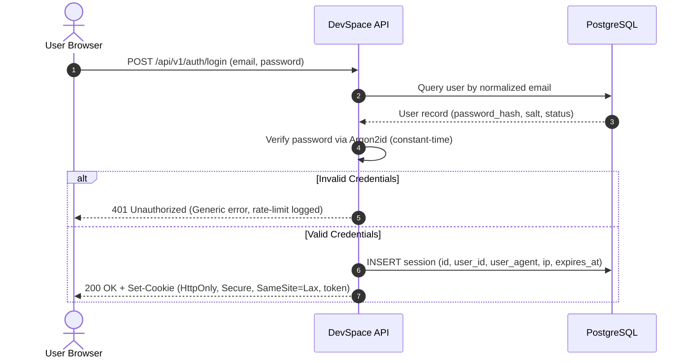
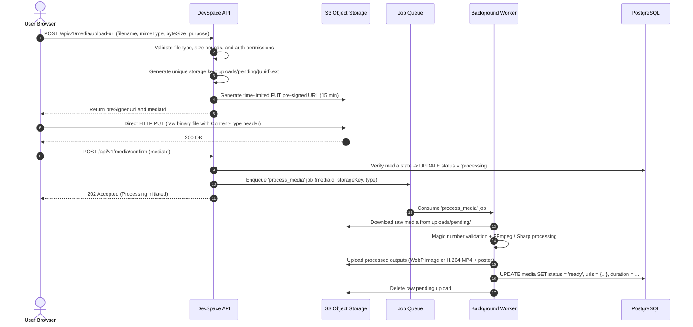
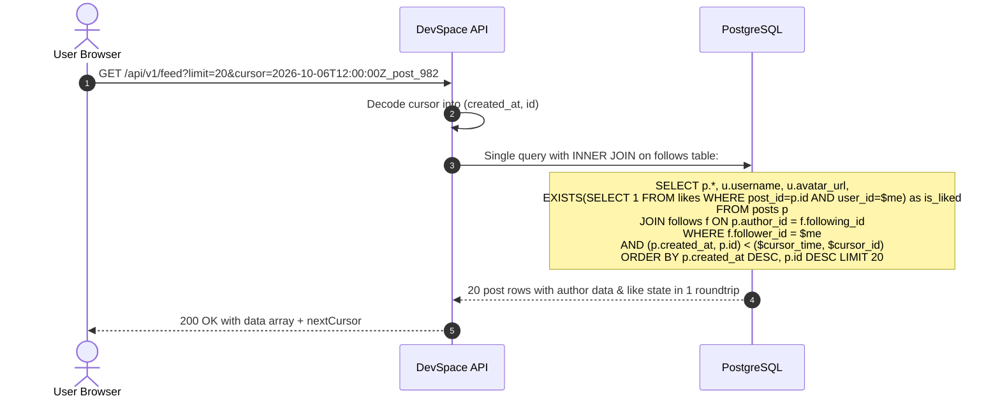

# DevSpace — System Architecture Specification

## 1. Architectural Paradigms Evaluation

To select the most robust, maintainable, and cost-efficient architecture, we systematically evaluated six architectural paradigms against DevSpace's requirements:

| Paradigm | Assessment for DevSpace | Verdict |
|---|---|---|
| **Microservices** | DevSpace is a single unified developer platform with closely coupled data models (users, posts, comments, likes, notifications). Splitting into 6+ microservices (User Service, Post Service, Notification Service, Media Service) introduces distributed transactions (Sagas), two-phase commits, high network latency overhead, complex deployment orchestration (Kubernetes, service meshes), and excessive infrastructure costs for a team of 1-5 engineers. | **REJECTED** (Premature optimization, operational nightmare) |
| **Serverless (Lambda/Cloud Functions)** | Serverless introduces cold starts (problematic for interactive feed latency), database connection exhaustion under bursty loads without expensive proxies, complex local development workflows, vendor lock-in, and unpredictable execution costs for media processing. | **REJECTED** (Suboptimal for relational DB pools & background encoding) |
| **Traditional Monolith** | A single codebase with intertwined controllers, services, and queries. While fast to build initially, lack of internal module boundaries inevitably leads to spaghetti code, tight coupling, and difficult team scaling. | **REJECTED** (High technical debt risk) |
| **Event-Driven Architecture (Pure)** | Pure event-driven systems (Kafka/RabbitMQ event streams for every user action) add eventual consistency issues (e.g. user publishes a post, refreshes page, and cannot see it because the read-model projection lagged). | **REJECTED** (Excessive complexity for CRUD and feed operations) |
| **Modular Monolith with Asynchronous Background Worker** | A single deployable service with strictly decoupled, domain-driven internal modules (Auth, Users, Posts, Interactions, Notifications, Media). Shares a single relational database with transactional consistency. Heavy background tasks (video transcoding, image optimization, email delivery) are offloaded to an asynchronous background worker process via an internal persistent queue. | **SELECTED (WINNER)** |

### Why Modular Monolith is the Optimal Architecture:
1. **Strong Domain Boundaries**: Code is organized into isolated domain modules (`auth/`, `posts/`, `comments/`, `notifications/`, `media/`) with explicit public interfaces and strict dependency rules.
2. **ACID Transactional Guarantees**: Social interactions (e.g. creating a post, associating media records, updating user post count) execute within atomic database transactions without two-phase commit overhead.
3. **Low Latency & High Throughput**: Inter-module calls are zero-cost in-memory function calls rather than JSON-over-HTTP or gRPC network serialization.
4. **Simplified Operational Footprint**: Can run entirely on a single modest server or container in development/staging, with the background worker process sharing the same codebase.
5. **Clear Migration Path**: If a single module (e.g., Media Transcoding or Search) ever needs independent scaling at 1,000,000+ users, it can be extracted into an independent microservice with zero changes to domain interfaces.

---

## 2. High-Level System Architecture Diagram

```mermaid
flowchart TB
    subgraph Clients["Clients Layer"]
        Browser["Modern Web Browser<br/>(Desktop / Mobile)"]
    end

    subgraph Edge["Edge & Delivery Layer"]
        CDN["Global CDN / Reverse Proxy<br/>(Caching Static Assets & Processed Media)"]
    end

    subgraph AppTier["Application Tier (Modular Monolith)"]
        API["Fastify / Node.js API Gateway & HTTP Server"]
        
        subgraph Modules["Domain Modules"]
            AuthMod["Auth & Session Module"]
            UserMod["User & Profile Module"]
            PostMod["Post & Markdown Engine"]
            InteractMod["Interactions (Likes/Comments/Follows)"]
            NotifMod["Notification Engine"]
            MediaMod["Media Orchestration Module"]
            SearchMod["Search Engine (Postgres FTS)"]
        end
        
        API --> AuthMod
        API --> UserMod
        API --> PostMod
        API --> InteractMod
        API --> NotifMod
        API --> MediaMod
        API --> SearchMod
    end

    subgraph AsyncTier["Background Processing Tier"]
        Queue["Persistent Queue / Job Broker<br/>(Redis BullMQ / Postgres SKIP LOCKED)"]
        Worker["Background Media & Task Worker<br/>(Sharp, FFmpeg, Notification Dispatcher)"]
    end

    subgraph DataStorage["Data & State Persistence"]
        Postgres[(Primary Relational DB<br/>PostgreSQL 16+<br/>Data, Metadata, FTS Indexes)]
        ObjectStorage[("Private S3-Compatible Object Storage<br/>(MinIO / AWS S3 / Cloudflare R2)<br/>Strictly Private Buckets with Origin Access Control")]
    end

    subgraph Observability["Observability Tier"]
        Logging["Structured JSON Logger (Pino)"]
        Metrics["Prometheus / OpenTelemetry Metrics"]
        Health["Liveness (/healthz) & Readiness (/readyz)"]
    end

    %% Client Interactions
    Browser -->|HTTPS Requests| CDN
    CDN -->|Dynamic API Traffic| API
    CDN -->|Origin Access Control (OAC) to Private Media Bucket| ObjectStorage
    CDN -->|Cached Media & Static Bundles| Browser
    Browser -->|Controlled Pre-Signed PUT Upload strictly via Short-Lived URL| ObjectStorage

    %% API Interactions
    Modules -->|SQL Queries & Transactions| Postgres
    MediaMod -->|Generate Pre-signed Upload URLs| ObjectStorage
    MediaMod -->|Enqueue Transcode Jobs| Queue
    NotifMod -->|Enqueue Notification Events| Queue
    
    %% Background Worker Interactions
    Queue -->|Consume Jobs| Worker
    Worker -->|Fetch Raw Media / Store Transcoded| ObjectStorage
    Worker -->|Update Processing Status| Postgres
    Worker -->|Send Real-time Updates| NotifMod

    %% Observability Connections
    API -.-> Logging
    API -.-> Metrics
    API -.-> Health
    Worker -.-> Logging
```

---

## 3. Core Data Flow Pipelines

### Flow 1: Authentication & Secure Session Flow


---

### Flow 2: Zero-Bandwidth Direct Media Upload & Processing Flow
To prevent large image and video uploads from saturating API server network interfaces and blocking Node.js event loops, media is uploaded directly to Object Storage via Pre-signed URLs:



---

### Flow 3: Personalized Feed Generation (Hybrid Pull with Indexing)


---

### Flow 4: Real-time Notification Delivery
1. An action occurs (e.g. User A likes User B's post).
2. The `interactions` module creates an atomic row in the `notifications` table if $User\ A \ne User\ B$.
3. The module pushes a notification event to the in-memory or Redis event channel.
4. Active client connections (via Server-Sent Events / SSE endpoint `/api/v1/notifications/stream`) receive a lightweight SSE event payload:
   ```json
   { "type": "NEW_NOTIFICATION", "unreadCount": 5, "snippet": "Alex liked your post 'Deep Dive into B-Tree Indexes'" }
   ```
5. Client UI increments the notification badge counter instantly without constant polling.
