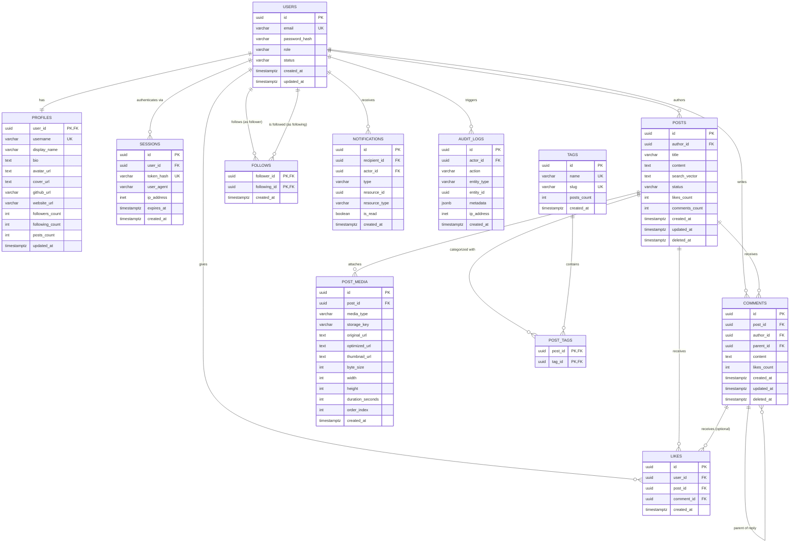

# DevSpace — Relational Database Design Specification

## 1. Database Philosophy & Principles
1. **Relational Integrity by Default**: Foreign keys with appropriate cascading (`ON DELETE CASCADE` for tightly bound children like comments/likes, `ON DELETE SET NULL` or soft deletes for user-generated root content).
2. **Denormalization strictly where justified**: Counter caches (e.g. `likes_count`, `comments_count`) maintained transactionally or via triggers to avoid expensive `COUNT(*)` queries on hot feeds.
3. **Cursor-based Pagination**: Every list endpoint uses keyset/cursor pagination based on immutable timestamp + UUID compound ordering, avoiding high-offset performance degradation.
4. **No Unbounded Queries**: Hard maximum page limits (`LIMIT 50`) enforced at the schema and query layer.
5. **Strong Column Constraints**: `NOT NULL`, `CHECK`, and `UNIQUE` constraints enforced at the database level to guarantee that bad application code cannot corrupt state.

---

## 2. Entity-Relationship Diagram (Mermaid)



---

## 3. Relational Schema DDL & Constraints

### 3.1 Users & Authentication Tables
```sql
CREATE TABLE users (
    id UUID PRIMARY KEY DEFAULT gen_random_uuid(),
    email VARCHAR(255) NOT NULL UNIQUE,
    password_hash VARCHAR(255) NOT NULL,
    role VARCHAR(32) NOT NULL DEFAULT 'user' CHECK (role IN ('user', 'moderator', 'admin')),
    status VARCHAR(32) NOT NULL DEFAULT 'active' CHECK (status IN ('active', 'suspended', 'deactivated')),
    created_at TIMESTAMPTZ NOT NULL DEFAULT NOW(),
    updated_at TIMESTAMPTZ NOT NULL DEFAULT NOW()
);

CREATE TABLE profiles (
    user_id UUID PRIMARY KEY REFERENCES users(id) ON DELETE CASCADE,
    username VARCHAR(32) NOT NULL UNIQUE,
    display_name VARCHAR(64) NOT NULL,
    bio TEXT,
    avatar_url TEXT,
    cover_url TEXT,
    github_url VARCHAR(255),
    website_url VARCHAR(255),
    followers_count INT NOT NULL DEFAULT 0 CHECK (followers_count >= 0),
    following_count INT NOT NULL DEFAULT 0 CHECK (following_count >= 0),
    posts_count INT NOT NULL DEFAULT 0 CHECK (posts_count >= 0),
    updated_at TIMESTAMPTZ NOT NULL DEFAULT NOW(),
    CONSTRAINT valid_username CHECK (username ~ '^[a-zA-Z0-9_]{3,30}$')
);

CREATE TABLE sessions (
    id UUID PRIMARY KEY DEFAULT gen_random_uuid(),
    user_id UUID NOT NULL REFERENCES users(id) ON DELETE CASCADE,
    token_hash VARCHAR(64) NOT NULL UNIQUE,
    user_agent VARCHAR(512),
    ip_address INET,
    expires_at TIMESTAMPTZ NOT NULL,
    created_at TIMESTAMPTZ NOT NULL DEFAULT NOW()
);
CREATE INDEX idx_sessions_user_expires ON sessions(user_id, expires_at);
```

### 3.2 Posts & Media Tables
```sql
CREATE TABLE posts (
    id UUID PRIMARY KEY DEFAULT gen_random_uuid(),
    author_id UUID NOT NULL REFERENCES users(id) ON DELETE RESTRICT,
    title VARCHAR(255) NOT NULL,
    content TEXT NOT NULL,
    status VARCHAR(32) NOT NULL DEFAULT 'published' CHECK (status IN ('draft', 'published', 'archived', 'hidden')),
    likes_count INT NOT NULL DEFAULT 0 CHECK (likes_count >= 0),
    comments_count INT NOT NULL DEFAULT 0 CHECK (comments_count >= 0),
    search_vector TSVECTOR,
    created_at TIMESTAMPTZ NOT NULL DEFAULT NOW(),
    updated_at TIMESTAMPTZ NOT NULL DEFAULT NOW(),
    deleted_at TIMESTAMPTZ
);

-- Compound index for author timeline with cursor pagination
CREATE INDEX idx_posts_author_created ON posts(author_id, created_at DESC) WHERE deleted_at IS NULL;

-- Index for public global chronological/explore feed
CREATE INDEX idx_posts_created_at ON posts(created_at DESC) WHERE deleted_at IS NULL AND status = 'published';

-- Full-text search GIN index
CREATE INDEX idx_posts_search_vector ON posts USING GIN(search_vector);

CREATE TABLE post_media (
    id UUID PRIMARY KEY DEFAULT gen_random_uuid(),
    post_id UUID REFERENCES posts(id) ON DELETE CASCADE,
    media_type VARCHAR(16) NOT NULL CHECK (media_type IN ('image', 'video')),
    storage_key VARCHAR(512) NOT NULL UNIQUE,
    original_url TEXT NOT NULL,
    optimized_url TEXT,
    thumbnail_url TEXT,
    byte_size INT NOT NULL,
    width INT,
    height INT,
    duration_seconds INT,
    order_index INT NOT NULL DEFAULT 0,
    created_at TIMESTAMPTZ NOT NULL DEFAULT NOW()
);
CREATE INDEX idx_post_media_post_id ON post_media(post_id, order_index ASC);
```

### 3.3 Interactions: Comments, Likes, and Follows
```sql
CREATE TABLE comments (
    id UUID PRIMARY KEY DEFAULT gen_random_uuid(),
    post_id UUID NOT NULL REFERENCES posts(id) ON DELETE CASCADE,
    author_id UUID NOT NULL REFERENCES users(id) ON DELETE RESTRICT,
    parent_id UUID REFERENCES comments(id) ON DELETE CASCADE,
    content TEXT NOT NULL,
    likes_count INT NOT NULL DEFAULT 0 CHECK (likes_count >= 0),
    created_at TIMESTAMPTZ NOT NULL DEFAULT NOW(),
    updated_at TIMESTAMPTZ NOT NULL DEFAULT NOW(),
    deleted_at TIMESTAMPTZ
);
CREATE INDEX idx_comments_post_created ON comments(post_id, created_at ASC) WHERE deleted_at IS NULL;
CREATE INDEX idx_comments_parent_id ON comments(parent_id) WHERE parent_id IS NOT NULL;

CREATE TABLE likes (
    id UUID PRIMARY KEY DEFAULT gen_random_uuid(),
    user_id UUID NOT NULL REFERENCES users(id) ON DELETE CASCADE,
    post_id UUID REFERENCES posts(id) ON DELETE CASCADE,
    comment_id UUID REFERENCES comments(id) ON DELETE CASCADE,
    created_at TIMESTAMPTZ NOT NULL DEFAULT NOW(),
    CONSTRAINT chk_like_target CHECK (
        (post_id IS NOT NULL AND comment_id IS NULL) OR
        (post_id IS NULL AND comment_id IS NOT NULL)
    )
);
-- Partial unique indexes enforcing database-level idempotency
CREATE UNIQUE INDEX uq_likes_user_post ON likes(user_id, post_id) WHERE post_id IS NOT NULL;
CREATE UNIQUE INDEX uq_likes_user_comment ON likes(user_id, comment_id) WHERE comment_id IS NOT NULL;
CREATE INDEX idx_likes_post ON likes(post_id) WHERE post_id IS NOT NULL;
CREATE INDEX idx_likes_comment ON likes(comment_id) WHERE comment_id IS NOT NULL;

CREATE TABLE follows (
    follower_id UUID NOT NULL REFERENCES users(id) ON DELETE CASCADE,
    following_id UUID NOT NULL REFERENCES users(id) ON DELETE CASCADE,
    created_at TIMESTAMPTZ NOT NULL DEFAULT NOW(),
    PRIMARY KEY (follower_id, following_id),
    CONSTRAINT chk_no_self_follow CHECK (follower_id <> following_id)
);
-- Reverse index for fast lookup of a user's followers
CREATE INDEX idx_follows_following ON follows(following_id, follower_id);
```

### 3.4 Notifications & Audit
```sql
CREATE TABLE notifications (
    id UUID PRIMARY KEY DEFAULT gen_random_uuid(),
    recipient_id UUID NOT NULL REFERENCES users(id) ON DELETE CASCADE,
    actor_id UUID NOT NULL REFERENCES users(id) ON DELETE CASCADE,
    type VARCHAR(32) NOT NULL CHECK (type IN ('post_liked', 'comment_added', 'user_followed', 'mention')),
    resource_id UUID NOT NULL,
    resource_type VARCHAR(32) NOT NULL CHECK (resource_type IN ('post', 'comment', 'user')),
    is_read BOOLEAN NOT NULL DEFAULT FALSE,
    created_at TIMESTAMPTZ NOT NULL DEFAULT NOW()
);
CREATE INDEX idx_notifs_recipient_read_created ON notifications(recipient_id, is_read, created_at DESC);

CREATE TABLE audit_logs (
    id UUID PRIMARY KEY DEFAULT gen_random_uuid(),
    actor_id UUID REFERENCES users(id) ON DELETE SET NULL,
    action VARCHAR(64) NOT NULL,
    entity_type VARCHAR(32) NOT NULL,
    entity_id UUID NOT NULL,
    metadata JSONB,
    ip_address INET,
    created_at TIMESTAMPTZ NOT NULL DEFAULT NOW()
);
CREATE INDEX idx_audit_logs_entity ON audit_logs(entity_type, entity_id);
CREATE INDEX idx_audit_logs_actor ON audit_logs(actor_id, created_at DESC);
```

---

## 4. Query Access Patterns, Scalability & Bottleneck Analysis

### 4.1 Personalized Following Feed (Anti-N+1 Strategy)
To retrieve the 20 most recent posts from followed users alongside author profiles and the current user's like status in a **single database query**:

```sql
SELECT 
    p.id,
    p.title,
    p.content,
    p.likes_count,
    p.comments_count,
    p.created_at,
    pr.username AS author_username,
    pr.display_name AS author_display_name,
    pr.avatar_url AS author_avatar_url,
    EXISTS(
        SELECT 1 FROM likes l 
        WHERE l.post_id = p.id AND l.user_id = $current_user_id
    ) AS is_liked_by_viewer,
    COALESCE(
        json_agg(
            json_build_object(
                'id', pm.id,
                'media_type', pm.media_type,
                'optimized_url', pm.optimized_url,
                'thumbnail_url', pm.thumbnail_url,
                'width', pm.width,
                'height', pm.height,
                'duration_seconds', pm.duration_seconds
            ) ORDER BY pm.order_index
        ) FILTER (WHERE pm.id IS NOT NULL), '[]'::json
    ) AS media
FROM posts p
INNER JOIN follows f ON p.author_id = f.following_id
INNER JOIN profiles pr ON p.author_id = pr.user_id
LEFT JOIN post_media pm ON p.id = pm.post_id
WHERE f.follower_id = $current_user_id
  AND p.deleted_at IS NULL
  AND p.status = 'published'
  AND (p.created_at, p.id) < ($cursor_created_at, $cursor_id)
GROUP BY p.id, pr.username, pr.display_name, pr.avatar_url
ORDER BY p.created_at DESC, p.id DESC
LIMIT 20;
```

#### Feed Scalability & Bottleneck Analysis:
1. **Initial Efficiency (<500 Following)**: For users following moderate numbers of authors, index `idx_follows_following` and `idx_posts_author_created` enable efficient index scans. Single roundtrip eliminates N+1 query overhead.
2. **Identified Bottleneck Threshold**:
   * *High-Following Users*: When a user follows 1,000+ accounts, the query planner must scan and merge hundreds of distinct index ranges.
   * *Buffer Pool Pressure*: As total post volume exceeds available PostgreSQL `shared_buffers` RAM, disk I/O latency will rise on cold feed lookups.
3. **Architectural Remediation Roadmap**:
   * When feed latency exceeds SLO targets (p95 > 150ms in synthetic load tests), introduce a hybrid timeline cache (fan-out-on-write to Redis lists for active users) or materialized timeline tables.
   * Do not introduce Redis timeline duplication prematurely before load tests prove database saturation.

### 4.2 Like / Unlike Concurrency & Counter Cache
To ensure `likes_count` is updated atomically without race conditions or counter desynchronization:
```sql
-- Atomic CTE Like with Idempotency Check
WITH inserted AS (
    INSERT INTO likes (user_id, post_id)
    VALUES ($user_id, $post_id)
    ON CONFLICT (user_id, post_id) DO NOTHING
    RETURNING id
)
UPDATE posts 
SET likes_count = likes_count + 1 
WHERE id = $post_id AND EXISTS (SELECT 1 FROM inserted);
```
* **Correctness**: If the like already exists, `ON CONFLICT` prevents duplicate records, `inserted` returns zero rows, and `posts.likes_count` is not incremented. Idempotency is strictly enforced at the database engine level.

---

## 5. Connection Pooling & Data Retention

* **Pool Sizing**: Fastify backend instances connect through `pg` with a min pool size of 5 and max pool size of 20 per Node.js process. With 2-4 cluster workers, total connection count remains under 80, comfortably below PostgreSQL's default `max_connections = 100`.
* **PgBouncer**: For scale > 1,000 CCU, PgBouncer is deployed in transaction pooling mode to support thousands of client connections with minimal Postgres backend processes.
* **Data Retention & Soft Deletes**: Posts and comments are marked with `deleted_at = NOW()` rather than immediate hard deletes, preventing breaking foreign keys in replies. A background vacuum/cleanup job hard-purges soft-deleted records older than 90 days.
