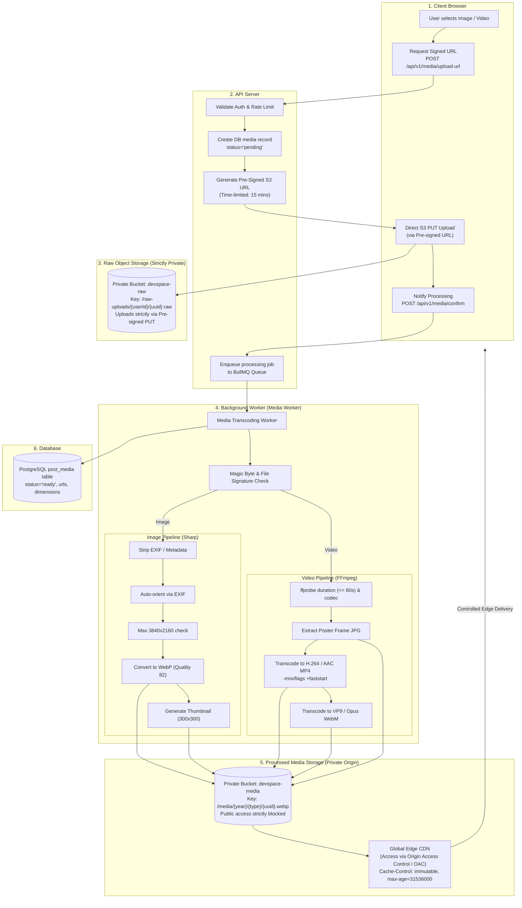

# DevSpace — Media Architecture & Pipeline Specification

## 1. Media Architecture Principles
1. **Zero Database Binary Blobs**: Relational tables strictly store URLs, dimensions, aspect ratios, durations, and storage keys.
2. **Zero API Server Bandwidth Bottlenecks**: Large file uploads bypass the API server entirely by uploading directly from the user's browser to S3-compatible Object Storage using short-lived, pre-signed upload URLs.
3. **Asynchronous Background Processing**: CPU-intensive image resizing and video transcoding are executed by dedicated worker processes via a job queue, preventing Node.js event loop lag.
4. **Permanent Edge Caching**: Processed media files are assigned content-addressed or UUID-based immutable keys and served via CDN with 1-year browser and edge cache headers.

---

## 2. End-to-End Media Pipeline



---

## 3. Storage Hierarchy & Access Control Strategy

Both raw uploads and processed media buckets are **strictly private origins** with all public ACLs and public bucket policies blocked (`BlockPublicAccess = ALL`):
1. **Raw Ingestion**: Clients upload strictly via short-lived (15-minute), cryptographically signed pre-signed PUT URLs scoped to exact content-length and content-type bounds. Direct anonymous writes to the bucket are rejected.
2. **CDN Delivery**: Media is retrieved exclusively through the CDN distribution using AWS CloudFront Origin Access Control (OAC) or Cloudflare authenticated origin pulls. Direct HTTP requests to the storage bucket endpoints are denied.

* **Pending / Raw Uploads** (private bucket):
  ```
  raw-uploads/{user_id}/{year}/{month}/{media_uuid}.raw
  ```
* **Processed Images** (public CDN bucket):
  ```
  images/{year}/{month}/{media_uuid}/display.webp      (max 1920px width, 82% quality)
  images/{year}/{month}/{media_uuid}/thumb.webp        (300x300 crop, 75% quality)
  ```
* **Processed Videos** (public CDN bucket):
  ```
  videos/{year}/{month}/{media_uuid}/video-720p.mp4    (H.264 / AAC, faststart enabled)
  videos/{year}/{month}/{media_uuid}/video-480p.mp4    (lower bitrate mobile fallback)
  videos/{year}/{month}/{media_uuid}/poster.webp       (extracted middle-frame poster)
  ```
* **Avatars & Covers**:
  ```
  avatars/{user_id}/{avatar_uuid}-256.webp
  covers/{user_id}/{cover_uuid}-1200.webp
  ```

---

## 4. Strict Upload Limits & Validation Rules

| Media Category | Max File Size | Allowed MIME Types | Max Dimensions | Max Duration | Magic Bytes (File Signature) |
|---|---|---|---|---|---|
| **Avatar Image** | 2 MB | `image/jpeg`, `image/png`, `image/webp` | 2048 × 2048 px | N/A | JPEG: `FF D8 FF`<br/>PNG: `89 50 4E 47 0D 0A 1A 0A`<br/>WebP: `52 49 46 46 ... 57 45 42 50` |
| **Post Image** | 10 MB | `image/jpeg`, `image/png`, `image/webp`, `image/avif` | 3840 × 2160 px | N/A | Same as above + AVIF: `....ftypavif` |
| **Post Video** | 50 MB | `video/mp4`, `video/webm`, `video/quicktime` | 1920 × 1080 px | 60 seconds | MP4/MOV: `....ftyp`<br/>WebM: `1A 45 DF A3` (EBML ID) |

### Magic Byte & Container Verification
* Filename extensions provided by the client are **never trusted**.
* The worker streams the first 512 bytes of the uploaded file to verify the true binary magic signature.
* If a user uploads a malicious script disguised as `photo.png` (`.php`, `.exe`, or SVG containing `<script>`), the magic byte validator immediately aborts processing, flags the upload as `rejected`, and schedules immediate deletion.

---

## 5. Processing Strategy (Sharp & FFmpeg)

### 5.1 Image Processing (Libvips / Sharp)
1. **EXIF Stripping**: All camera metadata, GPS location, and device serial numbers are permanently stripped to protect user privacy.
2. **Auto-Orientation**: Normalized based on orientation EXIF tag before EXIF is discarded.
3. **Pixel Flood / Decompression Bomb Protection**: Sharp is configured with a strict `limitInputPixels: 3840 * 2160 * 2` to prevent memory exhaustion from crafted compressed images with astronomical pixel dimensions.
4. **Encoding**: Transcoded to WebP format using multi-pass compression for 40-60% smaller file sizes compared to original JPEGs.

### 5.2 Video Processing (FFmpeg)
1. **Metadata Probing**: `ffprobe` extracts exact duration, stream count, and codecs:
   ```bash
   ffprobe -v error -show_entries format=duration -of default=noprint_wrappers=1:nokey=1 input.raw
   ```
   If duration > 61.0 seconds, the job fails with status `rejected_exceeds_duration`.
2. **Poster Extraction**: Extracts a high-quality frame at 20% into the video runtime:
   ```bash
   ffmpeg -ss 00:00:01 -i input.raw -vframes 1 -q:v 2 poster.jpg
   ```
3. **Web-Optimized Transcoding**:
   Transcodes to standard H.264 (baseline profile for universal iOS/Android/Desktop hardware acceleration) with `-movflags +faststart`:
   ```bash
   ffmpeg -i input.raw -c:v libx264 -preset slow -crf 23 -vf "scale='min(1280,iw)':-2" \
     -c:a aac -b:a 128k -movflags +faststart -max_muxing_queue_size 1024 output.mp4
   ```
   *Why `+faststart` is critical*: Relocates the MP4 `moov` atom (metadata index) from the end of the file container to the beginning. Without this flag, browser video players cannot begin rendering frames until the entire file payload has finished downloading. With `+faststart` and HTTP Range Requests, progressive streaming begins as soon as the initial metadata and buffer frames arrive.

#### Re-evaluation & Trade-off Analysis: MP4 vs HLS/DASH
* **Architectural Trade-offs of Single-Resolution MP4**:
  * *Strengths*: Highly simplified pipeline for short clips (<60s, <20 MB). Avoids generating dozens of chunk files (`.ts` or `.m4s`), writing master playlists (`.m3u8`), and managing complex segmented storage lifecycles.
  * *Limitations*: Unlike HLS/DASH, MP4 progressive download does **not** dynamically adapt to fluctuating network speeds (it cannot drop bitrate from 720p to 360p mid-stream). On unstable or low-bandwidth mobile connections, users may encounter initial buffering stalls.
  * *Verdict*: Acceptable for DevSpace v1 short technical clips, with HLS adaptive streaming identified as a future architectural evolution if mobile playback telemetry exhibits buffering spikes.

---

## 6. CDN Delivery & Caching Strategy

* **Cache Header Policy**:
  * All processed media URLs:
    `Cache-Control: public, max-age=31536000, immutable`
  * CDN edge servers cache assets indefinitely; client browsers never send re-validation conditional requests.
* **HTTP Range Requests**:
  * CDN and S3 Object Storage support HTTP `Range: bytes=0-1048576` headers, allowing video players to seek forward/backward instantly without downloading the intervening stream.

---

## 7. Cleanup & Garbage Collection Strategy

1. **Pending Uploads Expiration**:
   * Users may request an upload URL but abandon the form before publishing.
   * An S3 bucket Lifecycle Rule automatically purges objects in `raw-uploads/` older than 24 hours.
2. **Orphaned Media Cleaner Job**:
   * A daily scheduled cron job queries the database for `post_media` records where `post_id IS NULL` and `created_at < NOW() - INTERVAL '24 hours'`.
   * The job deletes the objects from S3 and removes the database rows.
3. **Hard-Deletion on Post Purge**:
   * When a post is permanently deleted, an asynchronous job removes all associated media keys from the processed bucket and invalidates CDN cache tags.
